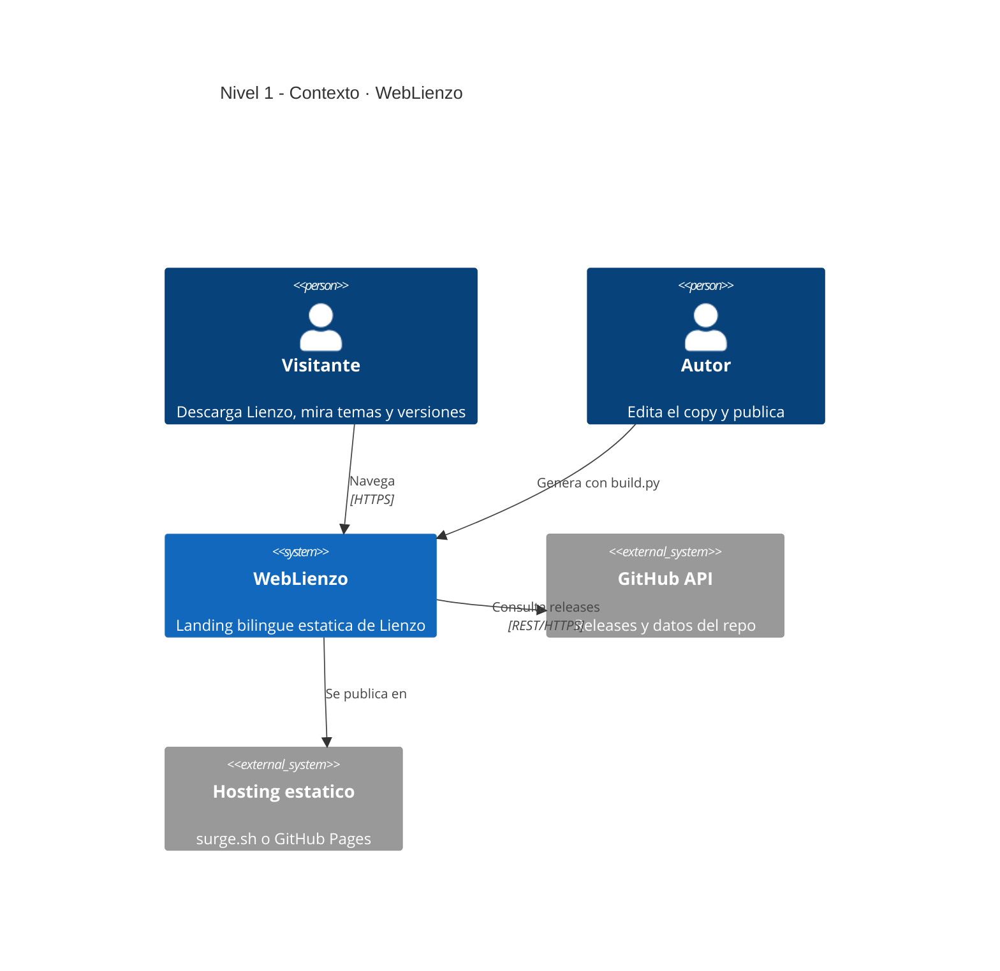
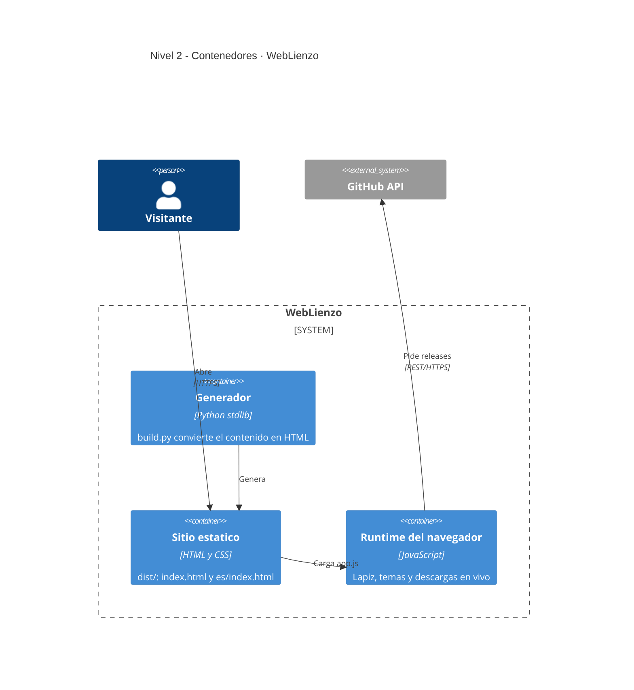
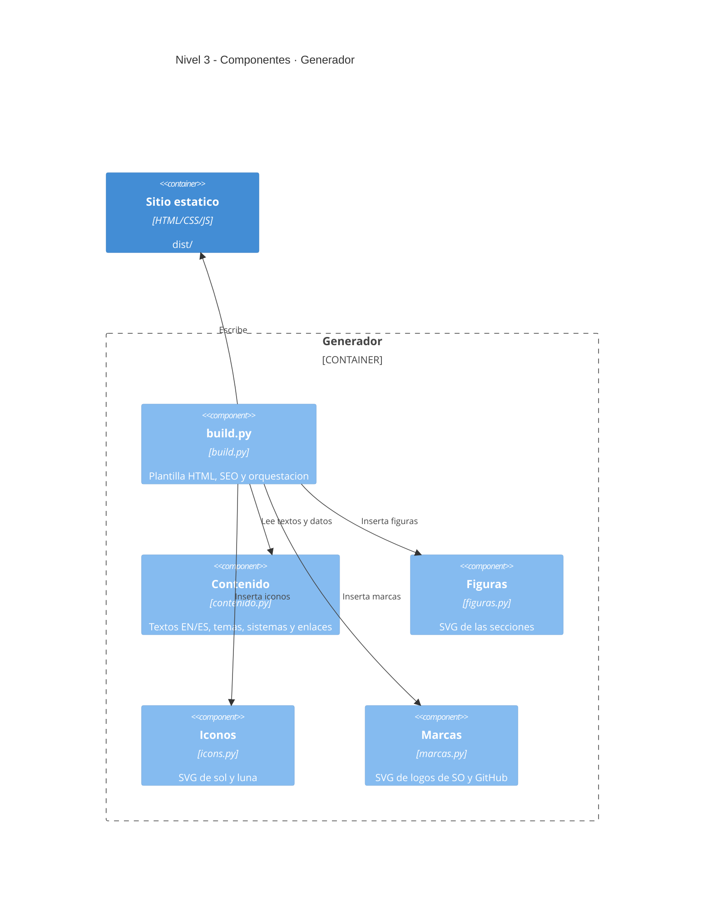

# WebLienzo

Este repositorio es el **sitio web** del proyecto [Lienzo](https://github.com/poncho-ajmv/Lienzo) — un Paint libre para Windows, Linux y macOS. Es un sitio estático bilingüe (español / inglés) que genera un script de Python — sin dependencias, sin build tools, sin runtime. Los enlaces de descarga y el historial de versiones salen en vivo del último release de GitHub, así que publicar una versión nueva no obliga a tocar el sitio.

---

## Uso

```bash
git clone https://github.com/poncho-ajmv/WebLiezo
cd WebLiezo

./probar.sh          # construye dist/ y lo abre en el navegador
python3 build.py     # solo construir -> dist/
npx surge dist       # publicar en surge.sh
```

`probar.sh` corre `build.py` y sirve `dist/` en `http://localhost:8000` (inglés) y `/es/` (español).

| Comando | Para qué |
|---|---|
| `python3 build.py` | Genera `dist/`: las dos páginas y los estáticos. |
| `./probar.sh` | Construye y sirve en local. |
| `npx surge dist` | Sube `dist/` a surge.sh. |

Para cambiar textos, temas o enlaces se toca **solo `contenido.py`**.

---

## Requisitos

| | Versión | Por qué |
|---|---|---|
| **Python** | **3.8+** | Solo biblioteca estándar; no hay `requirements.txt`. |
| **Node** (opcional) | cualquiera | Solo para `npx surge` al publicar. |

---

## Arquitectura (Modelo C4)

Diagramas en Mermaid — GitHub los dibuja solo, sin instalar nada.

### Nivel 1 — Contexto



### Nivel 2 — Contenedores



### Nivel 3 — Componentes (el generador)



---

## Qué NO viene en el repositorio

| Carpeta / archivo | Qué es | Cómo aparece |
|---|---|---|
| `dist/` | El sitio generado. No editar a mano. | `python3 build.py` |
| `__pycache__/` | Caché de Python | Se crea al ejecutar |
| `_mockup/` | Maquetas de diseño (borradores) | Gitignored |

---

## Estructura del proyecto

```
WebLienzo/
├── build.py          Plantilla HTML, SEO y orquestacion
├── contenido.py      Todos los textos (EN/ES), temas y enlaces
├── figuras.py        SVG de las secciones
├── icons.py          SVG de iconos (sol/luna)
├── marcas.py         SVG de logos de SO y GitHub
├── probar.sh         Construye y sirve en local
├── assets/
│   ├── styles.css    Estilos; la paleta sale del logo
│   ├── app.js        Lapiz, temas, descargas en vivo, deteccion de idioma
│   ├── img/          Logo y las veinte capturas (-l claro, -d oscuro)
│   └── fonts/        Instrument Sans e IBM Plex Mono, autoalojadas
└── dist/             Generado (gitignored)
```

---

## Antes de publicar

Cambiá `BASE` en `contenido.py` si el dominio no va a ser `lienzo.surge.sh`: de ahí salen el `canonical`, los `hreflang` y el `sitemap`.

---

## Idiomas

El sitio se genera en inglés (`/`) y español (`/es/`). La raíz detecta el idioma del navegador y redirige a `/es/` cuando está en español. Para agregar un idioma: copiá el bloque `'es'` de `TEXTOS` en `contenido.py`, traducilo, y sumá la salida en `main()` de `build.py`.

---

## Despliegue

**Local:** `./probar.sh`

**Producción (surge):** `npx surge dist tu-dominio.surge.sh`

**Producción (GitHub Pages):** una GitHub Action que corra `python3 build.py` y publique `dist/`.

---

## Estado del proyecto

**Funciona y está verificado**

- Generación de las dos páginas (EN/ES) sin dependencias.
- Descargas y historial de versiones en vivo desde el último release de GitHub.
- Lápiz sobre toda la página, temas claro/oscuro y veinte capturas.
- Detección automática del idioma del navegador.

**Pendiente**

1. Publicación automática desde GitHub (Action de Pages o surge).

---

## Licencia

MIT · poncho-ajmv
